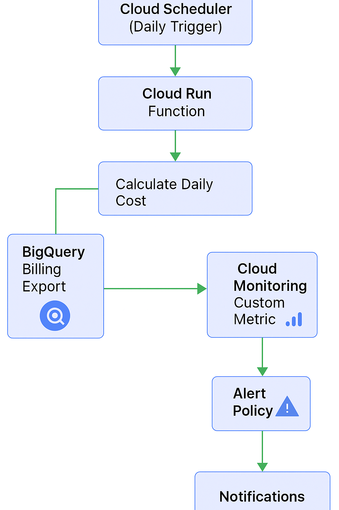

# BigQuery Daily Cost Monitoring

Automated solution for monitoring daily BigQuery costs using Cloud Run, Cloud Scheduler, and Cloud Monitoring custom metrics.

## Architecture



## Features

- **Automated Daily Monitoring**: Runs automatically via Cloud Scheduler
- **Custom Metrics**: Writes cost data to Cloud Monitoring
- **Alert Policies**: Configurable thresholds for cost anomalies
- **Per-Project Attribution**: Tracks costs by GCP project
- **Secure**: Uses parameterized queries and IAM service accounts

## Prerequisites

- GCP Project with billing export enabled
- Terraform >= 1.0
- gcloud CLI configured
- Billing Export to BigQuery configured

## Setup

### 1. Enable Required APIs

```bash
gcloud services enable \
  cloudbuild.googleapis.com \
  run.googleapis.com \
  cloudscheduler.googleapis.com \
  monitoring.googleapis.com \
  bigquery.googleapis.com